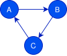

---
references:
  - type: web
    title: Specialization
    url: https://rust-lang.github.io/rfcs/1210-impl-specialization.html
    id: RFC-1210
  - type: web
    title: The Rustonomicon
    url: https://doc.rust-lang.org/stable/nomicon/
    id: nomicon
---

# ไลบรารีมาตรฐาน

## เทรต [`Send`] และ [`Sync`]

เทรต [`Send`] และ [`Sync`] (นิยามอยู่ใน `std::marker` หรือ `core::marker`) เป็น
มาร์กเกอร์เทรต (marker trait) ที่ใช้รับประกันความปลอดภัยของภาวะพร้อมกัน (concurrency) ใน Rust
เมื่อนำไปใช้งานอย่างถูกต้อง เทรตเหล่านี้ช่วยให้คอมไพเลอร์ Rust รับประกันได้ว่า
ไม่มีการแข่งกันของข้อมูล (data race) ความหมายของเทรตทั้งสองมีดังนี้:

- ชนิดข้อมูลเป็น [`Send`] หากการส่ง (ย้าย) ชนิดข้อมูลนั้นไปยังเธรดอื่นมีความปลอดภัย
- ชนิดข้อมูลเป็น [`Sync`] หากการแชร์การอ้างอิงแบบไม่เปลี่ยนค่า (immutable reference) ของชนิดข้อมูลนั้นกับ
  เธรดอื่นมีความปลอดภัย

เทรตทั้งสองเป็น _เทรตที่ unsafe (unsafe traits)_ กล่าวคือ คอมไพเลอร์ Rust ไม่ได้ตรวจสอบด้วยวิธีใด ๆ
ว่ามีการนำเทรตไปใช้งานอย่างถูกต้องหรือไม่ อันตรายนี้มีอยู่จริง:
การนำไปใช้งานอย่างไม่ถูกต้องอาจนำไปสู่**พฤติกรรมไม่นิยาม (undefined behavior)**

โชคดีที่ในกรณีส่วนใหญ่ ไม่จำเป็นต้องนำเทรตเหล่านี้ไปใช้งานเอง ใน Rust
ชนิดข้อมูลพื้นฐานเกือบทั้งหมดเป็น [`Send`] และ [`Sync`] และสำหรับชนิดข้อมูลผสม (compound type)
ส่วนใหญ่ คอมไพเลอร์ Rust จะนำเทรตไปใช้งานให้โดยอัตโนมัติ
ดังที่กล่าวไว้ใน [Rustonomicon @nomicon] ข้อยกเว้นที่สำคัญได้แก่:

- ตัวชี้ดิบ (raw pointer) ไม่เป็นทั้ง [`Send`] และ [`Sync`] เพราะไม่มีกลไกป้องกันความปลอดภัยใด ๆ
- [`UnsafeCell`] ไม่เป็น [`Sync`] (และด้วยเหตุนี้ [`Cell`] และ [`RefCell`] จึงไม่เป็นด้วย)
  เพราะเปิดให้แก้ไขค่าภายในได้ (interior mutability, ค่าที่แชร์กันและแก้ไขได้)
- [`Rc`] ไม่เป็นทั้ง [`Send`] และ [`Sync`] เพราะตัวนับการอ้างอิงถูกแชร์และ
  ไม่มีการซิงโครไนซ์

การนำ [`Send`] (หรือ [`Sync`]) ไปใช้งานโดยอัตโนมัติจะเกิดขึ้นกับชนิดข้อมูลผสม
(โครงสร้างหรืออีนัม (enum)) เมื่อฟิลด์ทุกตัวมีชนิดข้อมูลที่เป็น [`Send`]
(หรือ [`Sync`])

หากต้องการป้องกันไม่ให้ [`Send`] หรือ [`Sync`] ถูกนำไปใช้งานโดยอัตโนมัติ สามารถทำได้โดยใช้
  ฟิลด์ภายในที่มีชนิดเป็น [`PhantomData`]

```rust,noplaypen
# use std::marker::PhantomData;
#
struct SpecialType(u8, PhantomData<*const ()>);
```

<div class="reco" id="LANG-SYNC-TRAITS" type="กฎ" title="แสดงเหตุผลประกอบการนำ `Send` และ `Sync` ไปใช้งาน">

ในการพัฒนาด้วย Rust อย่างปลอดภัย ควรหลีกเลี่ยงการนำเทรต [`Send`] และ
[`Sync`] ไปใช้งานด้วยตนเอง และหากจำเป็น ต้องแสดงเหตุผลประกอบ
และจัดทำเอกสารกำกับไว้

</div>

## เทรตสำหรับการเปรียบเทียบ ([`PartialEq`], [`Eq`], [`PartialOrd`], [`Ord`])

การเปรียบเทียบ (`==`, `!=`, `<`, `<=`, `>`, `>=`) ใน Rust อาศัยเทรตมาตรฐานสี่ตัว
ที่มีอยู่ใน `std::cmp` (หรือ `core::cmp` สำหรับการคอมไพล์แบบ `no_std`):

- [`PartialEq<Rhs>`] ซึ่งนิยามความสมมูลบางส่วน (partial equivalence) ระหว่าง
  ออบเจกต์ชนิด `Self` และ `Rhs`,
- [`PartialOrd<Rhs>`] ซึ่งนิยามการจัดลำดับบางส่วน (partial order) ระหว่างออบเจกต์ชนิด
  `Self` และ `Rhs`,
- [`Eq`] ซึ่งนิยามความสมมูลทั้งหมด (total equivalence) ระหว่างออบเจกต์ชนิดเดียวกัน
  เป็นเพียงมาร์กเกอร์เทรตที่กำหนดให้ต้องมี `PartialEq<Self>`!
- [`Ord`] ซึ่งนิยามการจัดลำดับทั้งหมด (total order) ระหว่างออบเจกต์ชนิดเดียวกัน
  โดยกำหนดให้ต้องมีการนำ `PartialOrd<Self>` ไปใช้งาน

ดังที่ระบุไว้ในไลบรารีมาตรฐาน Rust ตั้งสมมติฐาน**อินแวเรียนต์จำนวนมาก (invariants)**
เกี่ยวกับการนำเทรตเหล่านี้ไปใช้งานแต่ละครั้ง:

- สำหรับ [`PartialEq`]

  - _ความสอดคล้องภายใน (internal consistency)_: `a.ne(b)` เทียบเท่ากับ `!a.eq(b)` กล่าวคือ `ne` เป็น
    ตัวผกผันแบบเข้มงวดของ `eq` การนำ `ne` ไปใช้งานแบบค่าเริ่มต้นก็เป็นเช่นนั้นพอดี

  - _ความสมมาตร (symmetry)_: `a.eq(b)` และ `b.eq(a)` เทียบเท่ากัน จากมุมมองของ
    ผู้พัฒนา หมายความว่า:

    - มีการนำ `PartialEq<B>` ไปใช้งานสำหรับชนิด `A` (เขียนแทนด้วย `A: PartialEq<B>`),
    - มีการนำ `PartialEq<A>` ไปใช้งานสำหรับชนิด `B` (เขียนแทนด้วย `B: PartialEq<A>`),
    - การนำไปใช้งานทั้งสองสอดคล้องกัน

  - _การถ่ายทอด (transitivity)_: `a.eq(b)` และ `b.eq(c)` นำไปสู่ `a.eq(c)` ซึ่งหมายความว่า:

    - `A: PartialEq<B>`,
    - `B: PartialEq<C>`,
    - `A: PartialEq<C>`,
    - การนำไปใช้งานทั้งสามสอดคล้องกัน (รวมถึงการนำไปใช้งานแบบสมมาตรของแต่ละรายการ)

- สำหรับ [`Eq`]

  - มีการนำ `PartialEq<Self>` ไปใช้งาน

  - _การสะท้อนกลับ (reflexivity)_: `a.eq(a)` ซึ่งหมายถึง `PartialEq<Self>` ([`Eq`] ไม่มี
    เมธอดใด ๆ ให้)

- สำหรับ [`PartialOrd`]

  - _ความสอดคล้องกับการเทียบเท่า (equality consistency)_:
    `a.eq(b)` เทียบเท่ากับ `a.partial_cmp(b) == Some(std::cmp::Ordering::Equal)`

  - _ความสอดคล้องภายใน (internal consistency)_:

    - `a.lt(b)` ก็ต่อเมื่อ `a.partial_cmp(b) == Some(std::cmp::Ordering::Less)`,
    - `a.gt(b)` ก็ต่อเมื่อ `a.partial_cmp(b) == Some(std::cmp::Ordering::Greater)`,
    - `a.le(b)` ก็ต่อเมื่อ `a.lt(b) || a.eq(b)`,
    - `a.ge(b)` ก็ต่อเมื่อ `a.gt(b) || a.eq(b)`

    โปรดทราบว่าหากนิยามเพียง `partial_cmp` ความสอดคล้องภายในจะ
    ได้รับการรับประกันโดยการนำ `lt`, `le`, `gt` และ `ge` ไปใช้งานแบบค่าเริ่มต้น

  - _ปฏิสมมาตร (antisymmetry)_: `a.lt(b)` (ตามลำดับ `a.gt(b)`) นำไปสู่ `b.gt(a)`
    (ตามลำดับ `b.lt(a)`) จากมุมมองของผู้พัฒนา ยังหมายความว่า:

    - `A: PartialOrd<B>`,
    - `B: PartialOrd<A>`,
    - การนำไปใช้งานทั้งสองสอดคล้องกัน

  - _การถ่ายทอด (transitivity)_: `a.lt(b)` และ `b.lt(c)` นำไปสู่ `a.lt(c)` (เช่นเดียวกันกับ `gt`,
    `le` และ `ge`) ซึ่งยังหมายความว่า:

    - `A: PartialOrd<B>`,
    - `B: PartialOrd<C>`,
    - `A: PartialOrd<C>`,
    - การนำไปใช้งานสอดคล้องกัน (รวมถึงแบบสมมาตรของแต่ละรายการ)

- สำหรับ [`Ord`]

  - `PartialOrd<Self>`

  - _ภาวะทั้งหมด (totality)_: `a.partial_cmp(b) != None` เสมอ กล่าวอีกนัยหนึ่ง
    `a.eq(b)`, `a.lt(b)` และ `a.gt(b)` จะเป็นจริงเพียงหนึ่งเดียวเท่านั้น

  - _ความสอดคล้องกับ `PartialOrd<Self>`_: `Some(a.cmp(b)) == a.partial_cmp(b)`

คอมไพเลอร์ไม่ได้ตรวจสอบข้อกำหนดเหล่านี้เลย ยกเว้นการตรวจสอบชนิดข้อมูล (type checking)
เพียงอย่างเดียว อย่างไรก็ตาม การเปรียบเทียบเป็นเรื่องวิกฤต เพราะเข้าไปเกี่ยวข้องทั้ง
กับระบบที่ความพร้อมใช้งานเป็นเรื่องสำคัญ เช่น ตัวจัดตารางเวลา (scheduler) และ
ตัวกระจายโหลด (load balancer) และกับอัลกอริทึมที่ปรับแต่งเพื่อประสิทธิภาพซึ่งอาจใช้บล็อก `unsafe`
ในกรณีแรก การจัดลำดับที่ไม่ดีอาจนำไปสู่ปัญหาด้านความพร้อมใช้งาน เช่น
การติดตาย (deadlock)
ในกรณีที่สอง อาจนำไปสู่ปัญหาความปลอดภัยแบบคลาสสิกที่เกี่ยวข้องกับการละเมิด
ความปลอดภัยของหน่วยความจำ ซึ่งนับเป็นอีกปัจจัยหนึ่งที่สนับสนุนแนวปฏิบัติ
ในการจำกัดการใช้บล็อก `unsafe`

<div class="reco" id="LANG-CMP-INV" type="กฎ" title="ปฏิบัติตามอินแวเรียนต์ของเทรตสำหรับการเปรียบเทียบมาตรฐาน">

ในการพัฒนาด้วย Rust อย่างปลอดภัย การนำเทรตสำหรับการเปรียบเทียบมาตรฐาน
ไปใช้งาน ต้องปฏิบัติตามอินแวเรียนต์ที่อธิบายไว้ในเอกสาร

</div>

<div class="reco" id="LANG-CMP-DEFAULTS" type="ข้อเสนอแนะ" title="ใช้การนำเมธอดไปใช้งานแบบค่าเริ่มต้นของเทรตสำหรับการเปรียบเทียบมาตรฐาน">

ในการพัฒนาด้วย Rust อย่างปลอดภัย เมื่อนำเทรตสำหรับการเปรียบเทียบมาตรฐาน
ไปใช้งาน ควรนิยามเฉพาะเมธอดที่ไม่มีการนำไปใช้งานแบบค่าเริ่มต้น เพื่อลด
ความเสี่ยงในการละเมิดอินแวเรียนต์ที่เกี่ยวข้องกับเทรตเหล่านั้น

</div>

มีลินต์ของ Clippy สำหรับตรวจสอบว่าไม่มีการนิยาม `PartialEq::ne` ในการนำ
[`PartialEq`] ไปใช้งาน

Rust มาพร้อมกับวิธีมาตรฐานในการสร้างการนำเทรตสำหรับการเปรียบเทียบไปใช้งาน
โดยอัตโนมัติผ่านแอตทริบิวต์ `#[derive(...)]`:

- การ derive [`PartialEq`] จะนำ `PartialEq<Self>` ไปใช้งานด้วย
  **ความเท่ากันเชิงโครงสร้าง (structural equality)** โดยมีเงื่อนไขว่าชนิดย่อยแต่ละชนิดเป็น `PartialEq<Self>`
- การ derive [`Eq`] จะนำมาร์กเกอร์เทรต [`Eq`] ไปใช้งาน โดยมีเงื่อนไขว่าชนิดย่อย
  แต่ละชนิดเป็น [`Eq`]
- การ derive [`PartialOrd`] จะนำ `PartialOrd<Self>` ไปใช้งานเป็น
  **การจัดลำดับตามพจนานุกรม (lexicographical order)** โดยมีเงื่อนไขว่าชนิดย่อยแต่ละชนิดเป็น [`PartialOrd`]
- การ derive [`Ord`] จะนำ [`Ord`] ไปใช้งานเป็น**การจัดลำดับตามพจนานุกรม (lexicographical order)**
  โดยมีเงื่อนไขว่าชนิดย่อยแต่ละชนิดเป็น [`Ord`]

ตัวอย่างเช่น โค้ดสั้น ๆ ต่อไปนี้แสดงวิธีเปรียบเทียบ `T1` สองตัวได้อย่างง่ายดาย
ข้อความยืนยัน (assertion) ทั้งหมดเป็นจริง

```rust
#[derive(PartialEq, Eq, PartialOrd, Ord)]
struct T1 {
    a: u8, b: u8
}

# fn main() {
assert!(&T1 { a: 0, b: 0 } == Box::new(T1 { a: 0, b: 0 }).as_ref());
assert!(T1 { a: 1, b: 0 } > T1 { a: 0, b: 0 });
assert!(T1 { a: 1, b: 1 } > T1 { a: 1, b: 0 });
# println!("all tests passed.");
# }
```

<div class="warning">

การ derive เทรตสำหรับการเปรียบเทียบให้กับชนิดข้อมูลผสมขึ้นอยู่กับ
**ลำดับของฟิลด์** ไม่ใช่ชื่อฟิลด์

ประการแรก หมายความว่าการเปลี่ยนลำดับการประกาศของสองฟิลด์จะเปลี่ยน
การจัดลำดับตามพจนานุกรมที่เป็นผลลัพธ์ ตัวอย่างเช่น หากกำหนดชนิดข้อมูล
ที่จัดลำดับตัวที่สองดังนี้:

```rust,noplaypen
#[derive(PartialEq, Eq, PartialOrd, Ord)]
struct T2{
   b: u8, a: u8
};
```

เราจะได้ `T1 {a: 1, b: 0} > T1 {a: 0, b: 1}` แต่
`T2 {a: 1, b: 0} < T2 {a: 0, b: 1}`

ประการที่สอง หากการเปรียบเทียบระดับล่างตัวใดตัวหนึ่งเกิดการแพนิก ลำดับอาจเปลี่ยน
ผลลัพธ์ได้ เนื่องจากการนำไปใช้งานอัตโนมัติใช้ตรรกะลัดวงจร (short-circuit)

สำหรับอีนัม (enum) การเปรียบเทียบที่ derive มาจะขึ้นอยู่กับ**ลำดับของเวเรียนต์ (variant)** ก่อน
แล้วจึงขึ้นอยู่กับลำดับของฟิลด์

</div>

แม้จะมีข้อควรระวังเรื่องการจัดลำดับดังกล่าว การเปรียบเทียบที่ derive มาก็มีโอกาส
เกิดข้อผิดพลาดน้อยกว่าการเขียนด้วยตนเองมาก และทำให้โค้ดสั้นลงและดูแลรักษาง่ายขึ้น

<div class="reco" id="LANG-CMP-DERIVE" type="ข้อเสนอแนะ" title="derive เทรตสำหรับการเปรียบเทียบเมื่อทำได้">

ในการพัฒนาด้วย Rust อย่างปลอดภัย ควร derive การนำเทรตสำหรับการเปรียบเทียบ
มาตรฐานไปใช้งานโดยอัตโนมัติด้วย `#[derive(...)]` เมื่อจำเป็นต้องใช้ความเท่ากัน
เชิงโครงสร้างและการเปรียบเทียบตามพจนานุกรม การนำเทรตสำหรับการเปรียบเทียบ
มาตรฐานไปใช้งานด้วยตนเองทุกครั้ง ควรจัดทำเอกสารกำกับและแสดงเหตุผลประกอบ

</div>

## เทรต [`Drop`] ซึ่งเป็นตัวทำลาย (destructor)

ชนิดข้อมูลต่าง ๆ นำเทรต [`std::ops::Drop`] ไปใช้งานเพื่อดำเนินการบางอย่างเมื่อ
หน่วยความจำที่เชื่อมโยงกับค่าของชนิดข้อมูลนี้กำลังจะถูกเรียกคืน [`Drop`] ใน Rust
เทียบเท่ากับตัวทำลาย (destructor) ใน C++ หรือตัวจบ (finalizer) ใน Java

<div class="note">

การนำเทรตนี้ไปใช้งานจะเปลี่ยนความหมายเชิงการทำงาน (execution semantics) ของภาษา

</div>

การดรอป (dropping) เกิดขึ้นแบบเรียกซ้ำจากค่าชั้นนอกสุดไปยังค่าชั้นใน
เมื่อค่าหนึ่งหลุดออกนอกขอบเขต (หรือถูกดรอปอย่างชัดเจนด้วย [`mem::drop`])
ค่าดังกล่าวจะถูกดรอปในสองขั้นตอน ขั้นตอนแรกจะเกิดขึ้นเฉพาะเมื่อชนิดข้อมูล
ของค่านี้มีการนำ [`Drop`] ไปใช้งาน โดยเป็นการเรียกเมธอด [`mem::drop`] กับค่านั้น
ขั้นตอนที่สองเป็นการทำกระบวนการดรอปแบบเรียกซ้ำกับทุกฟิลด์ที่ค่าดังกล่าวบรรจุอยู่
โปรดทราบว่าการนำ [`Drop`] ไปใช้งาน**รับผิดชอบเฉพาะค่าชั้นนอกสุดเท่านั้น**

ประการแรกและสำคัญที่สุด การนำ [`Drop`] ไปใช้งานไม่ควรทำเป็นกิจวัตร
จำเป็นเฉพาะเมื่อชนิดข้อมูลต้องใช้ตรรกะของตัวทำลาย (destructor) เท่านั้น
อันที่จริง [`Drop`] มักถูกใช้เพื่อปลดปล่อยทรัพยากรภายนอก (การเชื่อมต่อเครือข่าย ไฟล์ ฯลฯ)
หรือเพื่อคืนหน่วยความจำ (เช่น ในสมาร์ตพอยน์เตอร์อย่าง `Box` หรือ [`Rc`])
ด้วยเหตุนี้ การนำเทรต [`Drop`] ไปใช้งานจึงมีแนวโน้มที่จะมีบล็อกโค้ด `unsafe`
รวมถึงการดำเนินการอื่น ๆ ที่สำคัญต่อความปลอดภัย

<div class="reco" id="LANG-DROP" type="กฎ" title="แสดงเหตุผลประกอบการนำ `Drop` ไปใช้งาน">

ในการพัฒนาด้วย Rust อย่างปลอดภัย การนำเทรต [`std::ops::Drop`]
ไปใช้งาน ต้องแสดงเหตุผลประกอบและจัดทำเอกสารกำกับไว้

</div>

ประการที่สอง ระบบชนิดข้อมูลของ Rust รับประกันเฉพาะความปลอดภัยของหน่วยความจำ
และจากมุมมองของระบบชนิดข้อมูล การดรอปที่ไม่เกิดขึ้นนั้นเป็นสิ่งที่ยอมรับได้
อันที่จริง มีหลายกรณีที่อาจนำไปสู่การดรอปที่ไม่เกิดขึ้น เช่น:

- วงจรการอ้างอิง (reference cycle) เช่น ในกรณีของ [`Rc`] หรือ [`Arc`],
- การเรียก [`mem::forget`] อย่างชัดเจน (ดูย่อหน้าเรื่อง
  [`mem::forget` และการรั่วของหน่วยความจำ](unsafe/memory.md#forget-and-memory-leaks)),
- การแพนิกในระหว่างการดรอป,
- การยุติโปรแกรมอย่างกะทันหัน (program aborts) และการแพนิกเมื่อเปิดใช้ abort-on-panic

และการดรอปที่ไม่เกิดขึ้นอาจนำไปสู่การเปิดเผยข้อมูลอ่อนไหว หรือการล็อก
ทรัพยากรที่มีจำกัดซึ่งนำไปสู่ปัญหาด้านความพร้อมใช้งาน

<div class="reco" id="LANG-DROP-NO-PANIC" type="กฎ" title="อย่าให้เกิดการแพนิกในการนำ `Drop` ไปใช้งาน">

ในการพัฒนาด้วย Rust อย่างปลอดภัย การนำเทรต [`std::ops::Drop`]
ไปใช้งาน ต้องไม่เกิดการแพนิก

</div>

นอกจากเรื่องการแพนิกแล้ว การดรอปที่สำคัญต่อความปลอดภัยควรได้รับการคุ้มครอง

<div class="reco" id="LANG-DROP-NO-CYCLE" type="กฎ" title="อย่าปล่อยให้เกิดวงจรของการอ้างอิงแบบนับจำนวนที่มี `Drop`">

ค่าที่มีชนิดข้อมูลซึ่งนำ [`Drop`] ไปใช้งาน ต้องไม่ถูกฝังโดยตรงหรือโดยอ้อม
ไว้ในวงจรของการอ้างอิงแบบนับการอ้างอิง
(ดูหัวข้อเรื่อง [ตัวชี้แบบนับการอ้างอิงที่เป็นวงจร](#cyclic-rc-pointer))


</div>

<div class="reco" id="LANG-DROP-SEC" type="กฎ" title="อย่าพึ่งพาเพียง `Drop` ในการรับประกันความปลอดภัย">

การดำเนินการด้านความปลอดภัยเมื่อสิ้นสุดการประมวลผลบางอย่าง (เช่น การลบกุญแจ (key erasure)
เมื่อสิ้นสุดการเข้ารหัสลับ) ต้องไม่พึ่งพาการนำเทรต [`Drop`]
ไปใช้งานเพียงอย่างเดียว

</div>

## ตัวชี้แบบนับการอ้างอิงที่เป็นวงจร ([`Rc`] และ [`Arc`]) {#cyclic-rc-pointer}

ตัวชี้แบบนับการอ้างอิง (reference-counting pointer) ช่วยให้สามารถโคลนค่าของชนิดข้อมูลใด ๆ ก็ได้
ในการทำเช่นนี้ ค่าเหล่านี้จะถูกเชื่อมโยงกับตัวนับที่ใช้นับจำนวนสำเนา (clone) ที่ผูกอยู่กับค่านั้น และเมื่อ
ตัวนับมีค่าเป็นศูนย์ ค่านั้นจะถูกทำลาย

กระบวนทัศน์นี้อาจทำให้เกิดการรั่วของหน่วยความจำ (memory leak) เมื่อใช้ตัวชี้แบบนับการอ้างอิงในลักษณะวงจร

<center>



</center>

ในตัวอย่างนี้ ออบเจกต์ `A`, `B` และ `C` ต่างก็ถูกอ้างอิงโดยออบเจกต์อื่นอย่างน้อยหนึ่งตัว: ตราบใดที่ออบเจกต์ทั้งสามนี้ยังอยู่
ก็จะไม่ถูกลบ ซึ่งส่งผลให้เกิดการรั่วของหน่วยความจำ

**การผสมผสาน** [การเปลี่ยนค่าได้ภายใน (interior mutability)](https://doc.rust-lang.org/reference/interior-mutability.html) การเรียกซ้ำ (recursivity) และตัวชี้แบบนับการอ้างอิงเข้าด้วยกันในนิยามชนิดข้อมูลเป็นสิ่งที่ไม่ปลอดภัย ซึ่งอาจก่อให้เกิดการรั่วของหน่วยความจำ อันนำไปสู่การโจมตีแบบ DDoS หรือการรั่วไหลของข้อมูลลับได้

ตัวอย่างต่อไปนี้แสดงการรั่วของหน่วยความจำดังกล่าวใน safe Rust:

```rust align bad
{{#include ../../examples/src/memory.rs:cyclic}}
```

การรั่วของหน่วยความจำแสดงให้เห็นได้ด้วย `valgrind`:

```
$ valgrind --leak-check=full target/release/safe-rust-leak 
==153637== Memcheck, a memory error detector
==153637== Copyright (C) 2002-2022, and GNU GPL'd, by Julian Seward et al.
==153637== Using Valgrind-3.19.0 and LibVEX; rerun with -h for copyright info
==153637== Command: target/release/safe-rust-leak
==153637== 
Hello, world!
==153637== 
==153637== HEAP SUMMARY:
==153637==     in use at exit: 48 bytes in 2 blocks
==153637==   total heap usage: 10 allocs, 8 frees, 3,144 bytes allocated
==153637== 
==153637== 48 (24 direct, 24 indirect) bytes in 1 blocks are definitely lost
                in loss record 2 of 2
==153637==    at 0x48417B4: malloc (vg_replace_malloc.c:381)
==153637==    by 0x10F8D4: safe_rust_leak::main
                (in /home/toto/src/safe-rust-leak/target/release/safe-rust-leak)
==153637==    by 0x10F7E2: std::sys::backtrace::__rust_begin_short_backtrace
                (in /home/toto/src/safe-rust-leak/target/release/safe-rust-leak)
==153637==    by 0x10F7D8: std::rt::lang_start::{{closure}}
                (in /home/toto/src/safe-rust-leak/target/release/safe-rust-leak)
==153637==    by 0x12A90F: std::rt::lang_start_internal
                (in /home/toto/src/safe-rust-leak/target/release/safe-rust-leak)
==153637==    by 0x10FA54: main
                (in /home/toto/src/safe-rust-leak/target/release/safe-rust-leak)
==153637== 
==153637== LEAK SUMMARY:
==153637==    definitely lost: 24 bytes in 1 blocks
==153637==    indirectly lost: 24 bytes in 1 blocks
==153637==      possibly lost: 0 bytes in 0 blocks
==153637==    still reachable: 0 bytes in 0 blocks
==153637==         suppressed: 0 bytes in 0 blocks
==153637== 
==153637== For lists of detected and suppressed errors, rerun with: -s
==153637== ERROR SUMMARY: 1 errors from 1 contexts (suppressed: 0 from 0)
```

<div class="reco" id="MEM-MUT-REC-RC" type="กฎ" title="หลีกเลี่ยงตัวชี้แบบนับการอ้างอิงที่เป็นวงจร">

ชนิดข้อมูลแบบเรียกซ้ำ (recursive type) ที่ใช้ตัวชี้แบบนับการอ้างอิงในการเรียกซ้ำ ต้องไม่ถูกใช้ร่วมกับการเปลี่ยนค่าได้ภายใน (interior mutability)

</div>

[`Rc`]: https://doc.rust-lang.org/std/rc/struct.Rc.html
[`Arc`]: https://doc.rust-lang.org/std/sync/struct.Arc.html
[`Cell`]: https://doc.rust-lang.org/std/cell/struct.Cell.html
[`RefCell`]: https://doc.rust-lang.org/std/cell/struct.RefCell.html
[`UnsafeCell`]: https://doc.rust-lang.org/std/cell/struct.UnsafeCell.html
[`PhantomData`]: https://doc.rust-lang.org/std/marker/struct.PhantomData.html
[`Send`]: https://doc.rust-lang.org/std/marker/trait.Send.html
[`Sync`]: https://doc.rust-lang.org/std/marker/trait.Sync.html
[`PartialEq`]: https://doc.rust-lang.org/std/cmp/trait.PartialEq.html
[`PartialEq<Rhs>`]: https://doc.rust-lang.org/std/cmp/trait.PartialEq.html
[`PartialOrd`]: https://doc.rust-lang.org/std/cmp/trait.PartialOrd.html
[`PartialOrd<Rhs>`]: https://doc.rust-lang.org/std/cmp/trait.PartialOrd.html
[`Eq`]: https://doc.rust-lang.org/std/cmp/trait.Eq.html
[`Ord`]: https://doc.rust-lang.org/std/cmp/trait.Ord.html
[`mem::forget`]: https://doc.rust-lang.org/std/mem/fn.forget.html
[`mem::drop`]: https://doc.rust-lang.org/std/mem/fn.drop.html
[`Drop`]: https://doc.rust-lang.org/std/ops/trait.Drop.html
[`std::ops::Drop`]: https://doc.rust-lang.org/std/ops/trait.Drop.html
